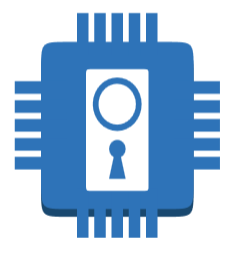

<!-- Header --> 

# PORTA RFID - Controle de Acesso por rádio identificação 

<div align="center">
    
</div>
<!-- Fim do Header -->


Colaboração para desenvolvimento do projeto Porta RFID. Conteúdo inicial copiado da página [Porta RFID, do Garoa Hacker Clube](https://garoa.net.br/wiki/Porta_RFID). 

O novo conteúdo deste README.md será editado na branch [features/inicial](https://github.com/torjc01/PortaRFID/tree/features/inicial) e graduado para a branch `prod`. 

# Tabela de conteúdo

## Tecnologia RFID - Visão geral 

## O que é RFID?

A tecnologia de Identificação por Radiofrequência, conhecida como RFID (`Radio Frequency Identification`), tem se tornado cada vez mais relevante e presente em diversos setores.  Esta tecnologia permite a identificação e o rastreamento de pessoas, objetos e animais por meio de tags eletrônicas, proporcionando benefícios significativos em áreas como logística, cadeia de suprimentos, varejo, saúde, controle de acesso, e muito mais. 

Um sistema RFID é a soma de alguns componentes principais: tags, antenas, leitoras e sistemas de informação.  que é apresentada ao sistema, e uma leitora que faz a identificação da tag e encaminha os dados para tratamento adequado em um computador ou microcontrolador. 

A leitora é constituida por um módulo de rádio emissor de sinal de determinada frequência e de uma antena. Por possuir alimentação elétrica própria é conhecida como dispositivo ativo da comunicação. Ela recebe a onda de rádio e a converte em dados digitais que serão tratados e armazenados por um sistema de informação. Existem dois tipos de leitoras: fixas, que são instaladas em um ambiente, e móveis, que podem ser levadas para ... 

A tag, por sua vez, é chamada de dispositivo passivo da comunicação, pois normalmente não dispõe de nenhuma fonte de energia própria. Ela é composta por um microchip que registra e processa informação, além de uma antena. Ela depende do campo magnético criado pela aproximação com a leitora para energizar o seu circuito e assim estabelecer a conexão e a troca de dados, de sua ID e de dados programáveis caso estejam disponíveis. Existem tags ativas, mas elas são utilizadas para casos de uso especiais em que a tag deve ser localizada a uma longa distância. 

As antenas permitem o estabelecimento da comunicação entre tags e leitoras. Elas podem ser integradas ao circuito da leitora, ou podem ser externas, para facilitar a instalação física. Sem uma antena, a leitora não seria capaz de receber as ondas de rádio, nem transmitir informação. 

O sistema de informação é necessário para fazer o tratamento dos dados e armazená-los em banco de dados. Ele deve ser capaz de programar tags, gerenciar dispositivos e dados, de fazer monitoramento remoto de tags e a configuração do hardware. 

Neste documento vamos explorar em detalhes os conceitos fundamentais de comunicação RFID, incluindo as diferentes frequências utilizadas, os padrões de comunicação, os tipos de tags disponíveis, o alcance da tecnologia e os principais normativos relacionados. 


## RFID: tags, frequências, categorias, padrões de comunicação e aplicações 

### Tags 

<div align="center">
    
</div>

As tags RFID estão disponíveis em diferentes formatos e funcionalidades, cada uma adequada para diferentes aplicações. As tags podem ser classificadas em três categorias principais: passivas, semi-passivas e ativas. 

`Tags passivas` não possuem uma fonte interna de energia e dependem da energia fornecida pelo leitor para alimentar suas operações. Elas são pequenas, de baixo custo e são amplamente utilizadas em aplicações como controle de estoque e identificação de produtos. No entanto, seu alcance de leitura é limitado em comparação com outros tipos de tags. 

`Tags semi-passivas`, também conhecidas como tags com bateria assistida, possuem uma bateria interna que fornece energia para alguns componentes internos, como sensores. Essas tagssão comumente emopregadas em aplicações que requerem funcionalidades adicionais, como monitoramento de temperatura ou detecção de movimento. 

`Tags ativas` são alimentadas por uma fonte de energia interna, como uma bateria. Elas possuem um alcance de leitura estendido e podem suportar uma ampla variedade de recursos, como transmissão contínua de dados, sensores avançados e comunicação bidirecional. Essas tags são usadas em aplicações que demandam longo tempo de leitura e monitoramento constante, como rastreamento de ativos e logística. 


### Frequências

A comunicação RFID utiliza diferentes faixas de radiofrequência para estabelecer a comunicação entre os leitores e as tags.

As três principais faixas de frequências empregadas são: baixa frequência (`low frequency - LF`), alta frequência (`high frequency - HF`) e ultra-alta frequência (`ultra-high frequency - UHF`). 

No mercado existem múltiplas opções de tags, que variam conforme as frequências dos diferentes campos eletromagnéticos que elas foram projetadas para operar. A escolha da frequência adequada depende das necessidades específicas da aplicação, levando em consideração fatores como alcance, tamanho das tags, interferências possíveis e custos associados. 


1. **Low frequency tags (LF)** 

Opera na faixa de 125KHz a 134KHz e é amplamente utilizado em aplicações de curto alcance. Essa frequência é menos suscetível a interferências e possui uma capacidade razoável de penetração em materiais, tornando-a ideal para aplicações como controle de acesso, identificação animal e sistemas de pagamento sem contato. 

- campo geral de frequência: de 30 KHz até 300 KHz
- campo primário de frequência: de 125 KHz até 134 KHz
- campo de leiura: quase contato até 10cm  
- tem a menor capacidade de transferência de dados de todas as tags RFID
- armazena uma pequena quantidade de dados 
- custo médio da tag: de $0,75 a $5,00  

Aplicações: rastreio animal, controle de acesso, keyfob de carros, rastreio de bens. 

2. **High frequency tags (HF)**

Opera na faixa de 13,56KHz e é comumente empregada em aplicações que exigem um alcance de leitura moderado. Essa frequência é amplamente adotada em cartões de identificação, etiquetas inteligentes para varejo e sistemas de pagamento por proximidade.  

- campo primário de frequência: 13,56 MHz
- campo de leitura: quase contato até 30cm 
- podem ser lidas múltiplas tags simultaneamente
- armazenam até 4Kb de dados 
- podem ser facilmente lidas próximo a água, tecidos, metais, madeira, corpo humano.    
- custo médio da tag: $0,20 a $10,00 

Aplicações: Livros de biblioteca, cartões de identificação pessoal, bagagem despachada, cartões de crédito, chips de poker, aplicações NFC. 

3. **Ultra-high frequency tags (UHF)**

Opera nas faixas de 860MHz a 960MHz e é conhecida por seu alcance de leitura estendido. Essa faixa de frequência é comumente utilizada em aplicações de cadeia de suprimentos, rastreamento de ativos, logística e inventário, devido à sua capacidade de leitura rápida de várias tags em longas distâncias. 

Existem dois padrões diferentes de tags UFH: ativas e passivas 

3.1. **UHF passive tags**

- campo primário de frequência: de 860 MHz a 960 MHz
- campo de leitura: quase contato até 25m 
- alta capacidade de transferência de dados 
- grande variedade de encapsulamento e tamanhos 
- custo médio da tag: $0,09 a $20,00

Aplicações: rastreio de supply chain, manufatura, indústria farmaceutica, pedágio eletrônico, rastreio de estoque, contagem de tempo em corridas, rastreio de bens. 

3.2 **UHF active tags** 

- campo primário de frequência: de 433 MHz
- campo de leitura: quase contato até mais de 100m 
- grande capacidade de memória 
- alta capacidade de transferência de dados 
- custo médio da tag: $25,00 a $50,00

Aplicações: rastreio de veículos, manufatura automobilistica, construção, mineiração, rastreio de bens. 


### Padrões de comunicação 

Os padrões de comunicação RFID estabelecem regras e os protocolos para troca de dados entre leitores e tags. Dois dos principais padrões são o `EPC - Electronic Product Code` e o `ISO International Standards Organization`. 

- EPC: o pardão EPC é amplamente utilizado em aplicações de logística e de varejo. Ele define uma estrutura de dados e permite a identificação única de itens e o compartilhamento eficiente de informações ao longo da cadeia de suprimentos. O EPC utiliza o protocolo de comunicação EPCGlobal, que permite uma interação consistente entre os dispositivos RFID. 

- ISO: o padrão ISO é adotado em diversos setores, como transporte, saúde e indústria. Os padrões ISO mais comuns para RFID incluem a séria `ISO 14443`, utilizada em cartões de identificação e sistemas de pagamento por proximidade; e a série `ISO 18000`, que abrange especificações para dierentes frequências e aplicações de RFID.  


### Normativos 

Diversas organizações e normativos regulam o uso do RFID em diferentes regiões do mundo. Esses normativos estabelecem limites de potência, frequências permitidas e outras regulamentações para garantir a operação adequada da tecnologia RFID e evitar interferências prejudiciais a outros sistemas de comunicação. Alguns dos principais órgãos reguladores incluem: 

- `Federal Communicatios Commission (FCC)`: responsável pela regulamentação das comunicações nos Estados Unidos, incluindo a utilização de frequências RFID. 

- `European Telecommunications Standards Institute (ETSI)`: responsável pela definição dos padrões de comunicação para a Europa, incluindo os regulamentos para RFID. 

- `Agência Nacional de Telecomunicações (ANATEL)`: é o órgão regulador das telecomunicações no Brasil e estabelece as diretrizes para o uso da RFID no país. 

- Outros órgãos reguladores, como o `International Telecommunication Union (ITU)` e o `Japan RFID Promotion Council (JRC)`, também desempenham papéis importantes no estabelecimento de normativos e padrões para a tecnologia RFID.  


**RFID: resumo**

|Frequência|Tipo|Uso|Pros and contras|Distância|
|---------------|------|----------|---------------|--------|
|125-148 KHz|Passivo|Rastreio animal (ISO11784/11785), controle de acesso, e aplicações OEM| Sinal negocia bem em liquidos e metais. Maoir custo da tag por causa do longo tamanho da antena de cobre. |1,5cm a 10cm é típico. 15cm a 30cm ou mais é possível com equipamento especializado.|
|13.56 MHz|Passivo|EAS(anti-furto), livros e gestão documental, controle de acesso, aplicações OEM |Antenas podem ser impressas em substrato, diminuindo os custos da tag. Interferência severa causada por metal.| Pode ser de alguns centímetros até vários metros, dependendo do hardware da leitora e do tipo de tag.|
|433 MHz (and 2.5 GHz)|Ativo|Sistemas de pagamento de pedágio, gestão de veículos/frota, acompanhamento de bens etc. | Longa distância. Custo da tag muito alto. Utiliza bateria, portanto tags têm uma vida útil definida (geralmente 5 anos). | Normalmente ao redor de 10 metros, mas pode alcançar até uma centena de metros.|
|915 MHz|Passivo|Acompanhamento de supply chain e aplicações OEM|Tags muito baratas. Longa distância. Recurso anti-colisão permite a leitura de diversas tags simultâneas. Interferência grave de líquidos e do corpo humano| Em torno de 3m de uma antena única ou de 6m entre duas antenas. Distâncias mais longas podem ser feitas com hardware especial.

## Conclusão 

Neste documento exploramos os conceitos fundamentais da comunicação RFID, abrangendo as diferentes frequências utilizadas, os padrões de comunicação, os tipos de tags disponíveis, o alcance da tecnologia e os principais normativos relacionados. Essa tecnologia oferece uma solução poderosa para a identificação e o rastreamento em diversos setores, proporcionando maior eficiência e precisão em  processos como logística, cadeia de suprimentos, varejo, saúide e muito mais. Compreender esses conceitos é essencial para explorar e implementar soluções de RFID de forma eficaz em uma ampla gama de aplicações técnicas e práticas.   

# Projeto Porta RFID 

(Texto da proposta inicial no site do Garoa HC)

- Proposta: criar um sistema que permita a abertura de uma porta (ou qualquer outra coisa) através de uma tag rfid, como visto no London Hackspace
- Ideia basica: um leitor RFID (touchatag) é ligado via USB a um computador. O computador lê o serial number da tag e consulta um banco de dados de membros com seu serial associado. Se o serial for válido, o computador, através de um arduino (ou qualquer outra coisa), aciona um relê, que por sua vez aciona uma trava eletrônica (tipo portão eletrônico), abrindo a porta
- Caveat: em Londres eles usavam o Oyster (tipo bilhete único) como tag. Podemos ver se o bilhete único pode servir ao mesmo propósito (nao, nao serve, eu ja testei. O bilhete unico usa 13MHz e tecnologia MiFare, diferentaço e com direito a encriptacao. Obviamente moooito mais caro. (tabajaralabs))
- Software: librfidiot
- Possíveis problemas: clonagem de tag rfid. Qual a segurança na leitura do serial? Associar com outro meio, como senha?
- Vantagens: se alguém perder a chave não é preciso trocar a de todos


## Arquitetura geral do sistema 

Um ACS (Access Control System) ou sistema de controle de acesso é um elemento essencial à segurança física de imóveis ou escritórios. Ele permite sob certas condições a entrada de pessoas autorizadas, e bloqueia o acesso de quem não está autorizado. Além disso, um ACS pode tipicamente monitorar os movimentos de entrada/saída de pessoas, assim como fornecer parâmetros de pesquisa para a criação de relatórios. Um sistema ACS avançado pode, além destas características, enviar notificações quando houver eventos de autenticação anormais, bem como integrar vigilância por vídeo.

Um sistema ACS ideal será composto por três componentes básicos: 

- `USU`  : componente visível ao usuário; 
- `ADM`  : componente visível ao administrador; 
- `INFRA`: componente de infra-estrutura. 

### USU

O componente `USU` é formado pela fechadura; pelas tags, cartões ou keyfobs; pelo sensor RFID; e pelo cabeamento que o liga aos outros componentes. É a parte mais visível de todo o sistema, que é exposta ao público geral. Proteções contra `tampering` e vandalismo devem ser adotadas neste componente para evitar que o sistema seja hackeado ou inutilizado. 

### ADM

O componente `ADM` é basicamente composto pelo software que permite a pilotagem do sistema. Tipicamente ele engloba uma interface de provisionamento dos acessos (concessão, suspensão, retirada e revogação); um portal de gerenciamento dos parâmetros do sistema, com um dashboard de acompanhamento (acessos permitidos, acessos negados, quantidade de leituras, delta entre entradas e saídas, etc). Todos estes componentes são de uso dos responsáveis pela gestão de segurança física, sejam eles chefe de segurança, gerente de TI, administrador, etc, mas nunca são de acesso geral aos usuários da empresa. 

### INFRA 

A componente `INFRA` engloba partes que dependem da infra-estrutura das instalações físicas para funcionar: fechaduras, o controlador, o servidor e o cabeamento de baixa tensão. 

- **A fechadura eletrônica** abre a porta seguindo uma mensagem de um comando elétrico recebido do controlador; o cabeamento de baixa tensão deve ser instalado entre os dois componentes para viabilizar esta troca de mensagens. As fechaduras funcionam basicamente em dois modos distintos. `Fail safe` quando a fechadura fecha ao receber corrente elétrica; em `fail secure` a fechadura abre quando recebe corrente elétrica. Para ser conforme a diversas regulamentações, normas dos bombeiros e códigos de construção, portas de entrada devem utilizar o modo `fail safe` pois as pessoas devem ser capazes de sair das instalações em caso de emergência, mesmo no evento de pane de energia elétrica.    

- **O controlador**, também conhecido como painél de controle de campo, ou ainda controlador inteligente, não é visível para a maior parte das pessoas. Em geral, é instalado em uma sala de TI, ou um em um painél elétrico, de telefone ou de comunicações. O acesso físico ao controlador deve ser protegido, pois ele possui todas as ligações de cabeamentos de baixa tensão que ligam para as fechaduras elétricas. 


- **O servidor** é o "cérebro" do conjunto, onde as credenciais são recebidas, avaliadas e a decisão de abrir ou não a fechadura é tomada. No servidor também são armazenadas as permissões de acesso no banco de dados. Este servidor pode ser uma máquina local rodando preferencialmente Linux; porém, se este for o caso, será necessário a presença de um responsável pelo servidor on-site. Isto poderá causar problemas caso uma empresa tenha múltiplas instalações. A alternativa seria um servidor cloud, onde uma única equipe pode oferecer vantagens em termos de manutenibilidade, disponibilidade de acesso e facilidade para atualização dos dados.


## Requisitos 

- Emissão imediata de novos acessos
- Emissão de tag de acesso permanente para membros do Garoa 
- Emissão de tag de acesso temporária com data/hora de expiração
- Revogação de tags de acesso emitidas  
- Casos de uso : 
    - MEMBROS: acesso principal; sem expiração 
    - VISITANTE: visita (acesso temporário)
    - PRESTADOR DE SERVIÇO: sob rendez-vous 
- Segurança e proteção criptográficas. 
- Verificação rápida de acesso do cliente

## Benefícios

- Gestão e apresentação simples e intuitiva de cartões de acesso:
    - atribuição de novos acessos 
    - controle de acessos temporários 
    - revogação de acessos
- As tags são personalizadas e ligadas a um usuário; todo evento de abertura de porta pode ser mapeado à pessoa associada a ele. 
- Flexibilidade: A solução pode ser usada pelos membros, fornecedores e visitantes. Também permite a gestão de acessos baseada em atributos ou papéis a diferentes tipos de locais (várias portas) ou de recursos (portas, gavetas, logon em aplicação, etc)
- Eficiência de custos: 
    - Elimina necessidade de trocar a chave de todos quando alguém perde sua chave pessoal, o que implica em economia em gastos com material 
    - Não há a necessidade de gerenciar cartões de plástico ou desenvolver uma aplicação separada para este objetivo.
- Duplicatas podem ser geradas para os que desejarem possuir uma tag de backup 
- Mais de uma porta ou dispositivo podem ser controlados por uma mesma tag 
- Possibilidade de fazer `BYOT` `Bring your own tag`: se a pessoa possuir uma tag já em uso, do trabalho por exemplo, e com frequência compatível ao sistema, é possivel atribuir acessos a esta tag


## Tecnologias utilizadas 

- Radio Frequency Identification
- Containeres 
- Prototipagem rápida em eletrônica

# Produto 

## Iterações 

### MVP Mininum viable product (Produto mínimo viável)

Para a primeira iteração, entregaremos um produto mínimo, mas que é suficiente para realizar a prova de conceito do projeto, que servirá de base para 
as outras iterações. Estas etapas seguintes entregarão a evolução do produto, conforme evoluir a especificação dos requisitos. 

Na primeira entrega, o circuito será montado sobre breadboard e ligado via jumpers. Ele será composto por um módulo NodeMCU, que será encarregado da interface com os outros componentes do sistema (módulos RFID e relê), bem como da tarefa de processamento das requisições de validação de acesso feitas ao software. 

O software também terá o mínimo necessário para o funcionamento da validação de acessos. Ele terá o cadastro das portas e um cadastro de cartões associados a uma pessoa. Sob requisição, o software receberá a identificação da porta, a identificação do cartão e verificará se esta relação de acesso existe. 

O software de cadastro não será criado para o MVP. O cadastro será feito via API da base de dados backend, por um dos dois canais: OpenAPI do Swagger, ou via coleção do Insomnia.  

**Lista de materiais para o MVP** 
- NodeMCU
- Módulo RFID
- Módulo relê
- Buzzer ou alto falantes de 8Ω
- Adaptador de tensão de 9V, 2A
- Conector Jack 2,5mm 
- Componentes discretos: leds, resistores, capacitores, fios jumper
- Breadboard

**Dados tratados pelo software no MVP**

Inicialmente, o depósito de dados para realizar a prova do conceito será uma tabela monolítica, não-normalizada ,que respoderá simplesmente ao codigo identificador da tag, relacionando-a a um nome de usuário e a uma porta. Se o registro existir, pressupõe-se o acesso autorizado.  

Após os primeiros testes conclusivos, a base de dados será modelada conforme os requisitos que forem apontados para a necessidade de controle de acesso específica que exista. Um começo de solução seria, por exemplo: 

- **Pessoa:** codigo, nome, sobrenome, numeroID 
- **Porta:** codigo, designacaoPorta
- **Acesso:** codigoPessoa, codigoPorta


### Iterações seguintes

As iterações seguintes serão plaejadas conforme evoluir a especificação dos requisitos. 

No entanto, algumas evoluções já estão previstas para as proximas etapas. 

- **Circuito:** criação de placa de circuito impresso, em substituição à breadboard e jumpers do protótipo; integração do módulo relê à placa de circuito
integrado, eliminando a necessidade do módulo; impressão de cobertura para a instalação da antena; construção de uma porta para testes.
- **Software:** criação de app de cadastro e manutenção dos acessos; frontend Angular; 
- **Banco de dados:** criação de um modelo de dados para implementação de sistema de acesso RBAC ou semelhante; registro de log de acessos;    
- **Firmware:** evolução do firmware para adaptação às novas funcionalidades. 

# Hardware

##    Diagrama de blocos 
<div align="center">
    
</div>

## Schematics e PCB 

##    Lista de Materiais 

- [Arduino Uno](https://ca.robotshop.com/products/arduino-uno-r3-usb-microcontroller?pr_prod_strat=collection_fallback&pr_rec_id=9e1056120&pr_rec_pid=7729821548695&pr_ref_pid=7728911941783&pr_seq=uniform) CAD 35.99

- [Node MCU](https://www.electromike.com/plaquette-nodemcu-v3-lua-iot-esp8266-wifi-arduino-nodemcu-lua.html) CAD 9.99

- [Módulo RFID RC522](https://ca.robotshop.com/products/mifare-rc522-module-rfid-reader) CAD 13.75

    **Especificações técnicas** 
        Frequência: 125 MHz  
        Interface com host: SPI  
        Voltagem operacional: 2.5 - 3.3V    
        Distância de leitura: até 3cm  

- [Módulo Relê HL-525 v1.0](https://www.canadarobotix.com/products/1347) CAD 5.09

- Fechadura elétrica Solenóide 12 V 

- Conector Jack 2.5mm 

- Adaptador de corrente 9V 2A 

- Buzzer ou Speaker 8Ω

- Led 5mm vermelho, Led 5mm verde, resistores, capacitores.  

##    Custos 

    Arduino: ~ R$100 --> Já temos (pra que arduino? Um atmega 8 resolve com um pé nas costas e custa 10 mangos!(tabajaralabs))  
    Trava eletrônica: ~ R$200 --> Tem uma na CCD  
    Leitor RFID Touchatag: ~ €30 ---> Comprado! Está na caixa do pitanga. (foi caro, tem aqui no BR por 50 reais (tabajaralabs))  
    Pacote de 25 tags RFID; ~ €25 (caso bilhete unico nao funcione) (tem chaveiros a 3 reais cada um (tabajaralabs))  

# Software 

##   Aplicação de Gestão de Acessos (Front-End, API, Banco de dados)

O software da aplicação de Gestão de Acessos é formado por três componentes principais: 
- a base de dados PostgreSQL; 
 responsável por armazenar todas as entidades de dados geridas pelo sistema;
 - uma API NestJS, 
 responsável por realizar a leitura dos dados disponíveis no banco de dados de permissões, bem como a atualização desta base por pessoas autorizadas; 
- aplicaçao front-end,
 em framework a escolher, para facilitar o acesso dos usuários às informações mantidas na BD.

Para simplificar o desenvolvimento e a manutenibilidade da aplicação a longo prazo, ela será desenvolvida e entregue conteneirizada, instalando em containers docker cada um dos componentes do sistema. Abaixo está ilustrada uma arquitetura proposta para o software.

<div align="center">
    
</div>


### Dependências  

- Docker 
- Docker-compose 
- Node.js
- NestJS
- BD PostgreSQL
- NodeRed
- Mosquitto 


### Instalação

Os dados do sistema são mantidos em uma base de dados **PostgreSQL**, e acessados via uma API backend em **NestJS**. Uma interface de usuário deverá ser criada para facilitar o acesso a estes dados. 

Para a execução da aplicação nos containers, primeiro é necessário criar um arquivo chamado `.env` no diretório `docker/`, e informar os valores que você preferir para as variáveis de ambiente abaixo, utilizadas para completar o docker-compose: 

```
APP=porta-
SUFFIX=
NETWORK=
POSTGRES_USER=
POSTGRES_PASSWORD=
POSTGRES_DB=
```

Em seguida, lance a aplicação com o comando seguinte: 

```
docker-compose up 
```

Logo após iniciar o container pela primeira vez, execute o comando abaixo para criar as credenciais no OmniDB: 

```
docker exec -it my_container python omnidb-server.py --createsuperuser=<nome usuario> <password>
```

###  Utilização 
###  Implantação produção 
###  Screenshots e fotos 


##   Firmware 
###  Dependências 

- Arduino IDE 
- Biblioteca RFID 
    - [MFRC522 library: https://github.com/miguelbalboa/rfid](https://github.com/miguelbalboa/rfid)
- Biblioteca WiFi 
    - [ESP8266WiFi library: https://github.com/esp8266/Arduino](https://github.com/esp8266/Arduino)    
    - [ESP8266WiFi Readthedocs: https://arduino-esp8266.readthedocs.io/en/latest/esp8266wifi/readme.html](https://arduino-esp8266.readthedocs.io/en/latest/esp8266wifi/readme.html)
###  Instalação
###  Utilização 
###  Implantação produção 
###  Screenshots e fotos

# FINAL 
##    Gestão de versões 
##    Outros recursos e docs importantes 
##    Troubleshooting

**Eu não consigo obter dados de entrada da leitora, ou obtenho a mensagem 'WARNING: Communication failure, is the MFRC522 properly connected?"**

- Verifique a conexão física. 
- Verifique a correspondência entre os pins/variáveis no código, veja o pin layout. 
- Verifique a solda dos pins do header. Talvez você tenha pontos de solda fria?
- Verifique a voltagem. O módulo RFID funciona com 3.3V. 
- SPI somente funciona com 3.3V, a maior parte dos módulos parece ser tolerante a 5V, mas tente usar um level shifter. 
- SPI não gosta de longos jumpers. Tente cabos menores.
- SPI não gosta de breadboards. Tente conexões soldadas. 

**As vezes eu obtenho timeout, ou as vezes a tag/cartão não funcionam.**

- Tente o outro lado da antena. 
- Tente diminuir a distância entre o MFRC522 e a sua tag. 
- Aumente o ganho da antena no firmware:  
    `mfrc522.PCD_SetAntennaGain(mfrc522.RxGain_max);`
- Use uma fonte de energia mais potente. 
- Às vezes a qualidade do hardware é realmente ruim. Contacte o seu fornecedor, troque por outro modelo. 

**Meu celular não reconhece o MFRC522 ou o meu MFRC522 não consegue ler dados de outro MFRC522**

- A simulação de cartão não é suportada. 
- A comunicação com aparelhos celulares não é suportada. 
- A comunicação peer-to-peer não é suportada.  


##    Problemas conhecidos
##    Onde encontrar ajuda 
##    Contribuir 
##    Interessados 

    -- Pitanga 12h34min de 3 de Agosto de 2010 (UTC)  
    -- Aleph 01h58min de 4 de Agosto de 2010 (UTC)  
    -- Felipe Bueno 10h38min de 29 de Abril de 2011 (UTC)  
    -- Alexandre Souza 16h04min de 26 de Julho de 2011 (UTC)  
    -- Haoji 04h32min de 11 de Agosto de 2013 (UTC)  
    -- Paulo F. Manasia 10h48min de 22 de Setembro de 2014 (UTC)  

##    Licença

Este projeto é licenciado sob a Licença MIT. Veja o arquivo LICENSE para mais detalhes.


##    Agradecimentos

Gostaria de agradecer e de dar crédito às bibliotecas abaixo, as quais foram utilizadas e deram inspiração para a criação dos sketches do firmware: 

- Biblioteca RFID MFRC522 e seu autor, `Miguel Balboa`: 
    - [MFRC522 library: https://github.com/miguelbalboa/rfid](https://github.com/miguelbalboa/rfid)  
- Biblioteca WiFi e ao `ESP8266 Community Forum` 
    - [ESP8266WiFi library: https://github.com/esp8266/Arduino](https://github.com/esp8266/Arduino)  

Também digno de menção é o software de exploração de banco de dados OmniDB que auxilia enormemente o trabalho de utilização do banco PostgreSQL com a linguagem SQL, ao invés do scripting nativo Postgres. 

- [OmniDB: https://github.com/OmniDB/OmniDB](https://github.com/OmniDB/OmniDB)
- [OmniDB Readthedocs: https://omnidb.readthedocs.io/en/latest/index.html](https://omnidb.readthedocs.io/en/latest/index.html)


##    Referências 
### Bibliografia  
*Graafstra, Amal.* **RFID Toys.** Wiley Publishing: Indianapolis, 2006.  
*IGOE, Tom.* **Beginning NFC: Near Field Communication with Adruino, Android & PhoneGAP.** O'Reilly: Sebastopol, 2014.  
*Norris, Donald.* **Projets créatifs avec Raspberry Pi.** Pearson France: Montreuil, 2014. 

### Sites web
[Paradox](https://www.paradox.ca) - empresa quebecoise, especializada na fabricação de sistemas de segurança, possível interessada na gestão de acessos.  
[Alarme Provinciale](https://www.alarmeprovinciale.com) - empresa quebecoise, varejista na venda, instalaçãoo e manutenção de sistemas de segurança física.  
[Documenting work: https://github.com/torjc01/DocumentingWork](https://github.com/torjc01/DocumentingWork) - minha reescritura de um artigo antigo da revista `Make` que fornece orientações particularmente interessantes e úteis para a documentação de todo tipo de projeto.  
[TT Electronics](https://blog.ttelectronics.com/rfid-technology) - blog sobre RFID  
[Atlas RFID Store](https://atlasrfidstore.com) - companhia especializada em equipamentos para RFID  
